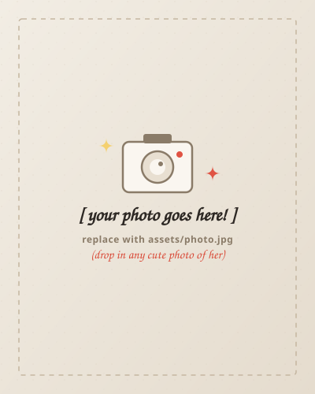

# ✦ A Little Thing For You :> (Handmade Digital Keepsake)

A single-page, mobile-first personal website designed like a handmade editorial scrapbook / printed card. Warm, playful, cute without being overly romantic, and youthful with a little nerdy charm.

---

## 📸 How to Put Her Real Photo In (30 Seconds)

1. Put your photo inside the `assets/` folder (e.g. name it `photo.jpg`).
2. Open `index.html` and find line ~65:
   ```html
   
   ```
3. Change `assets/photo-placeholder.svg` to `assets/photo.jpg`. Done!

---

## ✍️ How to Edit the Personal Message

Open `index.html` and scroll to the `<div class="letter-body">` section (around line ~85):
- Change the lead line: *"I made this little thing for you hehe."*
- Fill in your message paragraph with your inside jokes, teasing, or fun memories.
- You can use `<mark class="highlighter">words here</mark>` for yellow highlighter marks.
- You can use `<span class="scribble-strike">words here</span>` for playful strikethroughs.
- Edit the signature at the bottom (`— me`).

---

## 🎨 Design System & Palette

All colors are controlled at the very top of `style.css`:
- **Paper Background**: `--paper-bg: #FBF8F2` (warm cream risograph paper)
- **Ink**: `--ink-main: #231F1D` (warm charcoal printing ink)
- **Accent Coral**: `--color-coral: #E05344` (vintage vermilion)
- **Highlighter**: `--color-yellow: #FDE68A` (warm marker yellow)
- **Washi Tape**: `--color-tape: rgba(244, 199, 195, 0.78)` (semi-translucent blush tape)

---

## 🚀 How to Share with Her

### Option 1: Netlify Drop (Fastest, 1-Click Free Hosting)
1. Visit [app.netlify.com/drop](https://app.netlify.com/drop).
2. Drag and drop the `personal-webpage` folder into the browser window.
3. It will give you a free, instant live HTTPS URL (e.g. `something-cute.netlify.app`) that you can text her!

### Option 2: GitHub Pages
1. Push this folder to a GitHub repository.
2. In repository **Settings > Pages**, enable GitHub Pages on the `main` branch.
3. Send her the live link.

### Option 3: Local Preview
Double click `index.html` to view it in your browser anytime.
